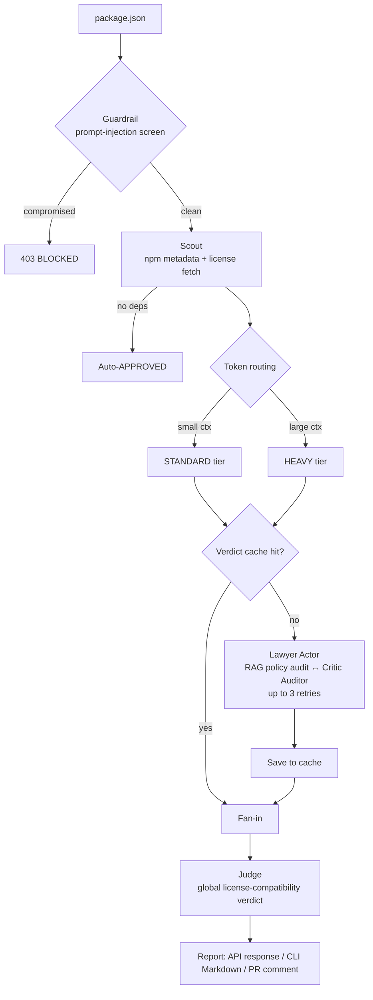

# 🛡️ Sentinel AI — Intelligent Dependency Auditor

Sentinel AI is a dependency security and license-compliance gatekeeper. It ingests a `package.json`, audits every package with a LangGraph Actor–Critic loop (Lawyer ↔ Critic), and returns a global compliance verdict — as a REST API, a CLI, or a GitHub Action comment on pull requests.

It runs fully local with **Ollama** (no cloud keys) or against **Groq** for CI, with **Qdrant** backing RAG policy lookups and a verdict cache.

## ✨ Features

* **Prompt-injection guardrail** — an Llama Guard classifier screens the manifest before any audit runs; malicious `package.json` payloads are rejected with `403`.
* **Parallel per-package audits** — LangGraph `Send` fans out one Actor–Critic branch per dependency and fans the results back in.
* **Actor–Critic loop** — the *Lawyer* (Actor) issues a license verdict via RAG over corporate policies; the *Critic* (Auditor) applies zero-trust review with up to 3 correction attempts per branch.
* **Token-aware model routing** — packages whose context exceeds a token threshold are routed to a heavier reasoning model; the rest use a lighter, faster tier.
* **Verdict caching** — repeat audits of the same package/license short-circuit the LLM loop via a Qdrant `verdict_cache` collection.
* **Global compliance judge** — a final LLM pass reconciles per-package verdicts into `APPROVED` or `REJECTED_WITH_CONFLICTS`.
* **Pluggable LLM providers** — `LLM_PROVIDER=ollama` (fully local) or `groq` (cloud, used in CI). Falls back to Ollama if no Groq key is set.
* **Durable audit history** — SQLite checkpointer persists every graph run per `thread_id`; history is queryable over HTTP.
* **CI-native** — a GitHub Action runs the audit on PRs, posts a Markdown report as a PR comment, and fails the build on forbidden licenses or security blocks.

## 🏗️ Project Structure

```text
sentinel-ai/
├── run_stack.py              # Bootstrap: Docker/Qdrant, policy seed, Ollama models, FastAPI
├── langgraph.json            # LangGraph dev/API graph definition
├── fixtures/
│   ├── package.json          # Sample manifest for audit
│   └── malicious_package.json# Prompt-injection test fixture
├── scripts/
│   ├── seed_policy.py        # Seeds corporate_policies into Qdrant
│   └── run_evals.py          # End-to-end eval suite against a running stack
├── app/
│   ├── main.py               # FastAPI entrypoint
│   ├── cli.py                # CLI + GitHub Actions report publisher
│   ├── core/                 # config, model registry, logging, terminal colors
│   ├── agents/
│   │   ├── graph.py          # Top-level graph: guardrail → scout → fan-out → judge
│   │   ├── subgraph_builder.py # Lawyer ↔ Critic Actor–Critic subgraph (standard/heavy tiers)
│   │   ├── state.py          # AgentState / PackageState schemas
│   │   └── nodes/            # guardrail, scout, lawyer, critic, judge
│   ├── services/
│   │   ├── llm_service.py    # Provider resolution (Groq / Ollama) + cached clients
│   │   ├── qdrant_service.py # Policy RAG + verdict cache
│   │   ├── license_service.py# npm / GitHub license evidence gathering
│   │   ├── github_service.py # GitHub API helpers
│   │   ├── osv_service.py    # OSV vulnerability lookups
│   │   └── token_service.py  # Context-token counting for tier routing
│   └── api/
│       ├── audit.py          # POST /api/v1/audit
│       └── history.py        # GET  /api/v1/audit/{thread_id}/history
├── .github/workflows/
│   └── sentinel-test.yml     # PR audit job (Groq + Qdrant service container)
├── sentinel.models.yml       # Provider + per-role model selection
└── requirements.txt
```

> **Note:** `backend/` is a legacy mirror of the root application kept for CI compatibility. Do all development in the top-level `app/` package.

## 🚀 Quick Start (Local, Ollama)

### 1. System Requirements

* **Docker Desktop** — running (used for Qdrant)
* **Ollama** — running at `http://localhost:11434`
* **Python 3.11+** virtual environment

### 2. One-Time Setup

```bash
python -m venv venv
source venv/bin/activate
pip install -r requirements.txt
cp .env.example .env   # optional — only needed for LangSmith tracing or Groq
```

Provider and models are selected in `sentinel.models.yml` (see [Choosing the provider and models](#choosing-the-provider-and-models)). With `provider: ollama`, `run_stack.py` pulls any missing models automatically.

### 3. Start Everything

```bash
venv/bin/python run_stack.py
```

`run_stack.py` performs these steps automatically:

1. **Docker** — verifies the daemon is running
2. **Qdrant** — starts an existing `qdrant` container or creates one on ports `6333` / `6334`
3. **Policy data** — waits for Qdrant health, checks `corporate_policies` (≥ 4 records); runs `scripts/seed_policy.py` if missing
4. **Ollama** — verifies the service is up, reads `ModelRegistry`, runs `ollama pull` for missing models
5. **FastAPI** — launches `python -m app.main` on `http://0.0.0.0:8000`

With `provider: groq` (the shipped default) and a valid `GROQ_API_KEY`, audits run in the cloud and `run_stack.py` skips the Ollama checks entirely.

## 🔌 API Usage

### Audit a manifest

```bash
curl -X POST "http://127.0.0.1:8000/api/v1/audit" \
     -H "Content-Type: application/json" \
     -d @fixtures/package.json
```

Response:

```json
{
  "status": "success",
  "thread_id": "…",
  "global_verdict": "APPROVED",
  "global_summary": "…",
  "results": [
    { "package_name": "lodash", "version": "4.17.21", "license": "MIT", "verdict": "SAFE", "reasoning": "…" }
  ]
}
```

A manifest containing prompt-injection text (try `fixtures/malicious_package.json`) returns `403 Security Exception`.

Pass `X-Thread-Id: <id>` on the request to pin the audit to a resumable checkpoint thread.

### Audit history

```bash
curl "http://127.0.0.1:8000/api/v1/audit/<thread_id>/history"
```

Returns every checkpoint of the graph run (state values, next node, checkpoint id) from the SQLite checkpointer in `data/sentinel_state.db`.

Interactive API docs: `http://localhost:8000/docs`.

## 💻 CLI

Run an audit without the server — useful locally or in CI:

```bash
python -m app.cli --package-json fixtures/package.json
```

* Prints a GitHub-flavored Markdown report; `--output report.md` also saves it locally.
* Exit code is `1` when the guardrail blocks the manifest or any package is `FORBIDDEN` / the global verdict is `REJECTED_WITH_CONFLICTS` — otherwise `0`.
* Inside GitHub Actions (`GITHUB_STEP_SUMMARY` / PR event env vars), it automatically writes the step summary and posts a PR comment.

## 🤖 GitHub Action

`.github/workflows/sentinel-test.yml` runs the CLI audit on every PR to `main`/`master`:

* Starts a `qdrant/qdrant` service container
* Uses Groq cloud models (`GROQ_API_KEY` secret, `LLM_PROVIDER=groq`)
* Posts the audit report as a PR comment via `GITHUB_TOKEN`
* Fails the check on forbidden licenses or a security block

CI provider and model ids come from `sentinel.models.yml` (provider: `groq`); the workflow's `LLM_PROVIDER=groq` env simply matches it.

## ⚙️ Configuration

| Env var | Default | Purpose |
| --- | --- | --- |
| `LLM_PROVIDER` | from `sentinel.models.yml` (default `groq`) | Selects cloud vs local models; overrides the YAML |
| `GROQ_API_KEY` / `LLM_API_KEY` | — | Required for the Groq provider |
| `SENTINEL_MODELS_PATH` | `sentinel.models.yml` | Override location of the model-selection file |
| `OLLAMA_BASE_URL` | `http://localhost:11434/v1` | Ollama OpenAI-compatible endpoint |
| `QDRANT_HOST` | `http://localhost:6333` | Vector DB for policy RAG + verdict cache |
| `SENTINEL_CI` | unset | Stateless mode: MemorySaver checkpointer, verdict cache bypassed |
| `SENTINEL_CONFIG_PATH` | `.sentinel.yml` | Override location of the license policy file |
| `LANGCHAIN_TRACING_V2` / `LANGCHAIN_API_KEY` | off | Optional LangSmith observability |

The license policy is YAML (`.sentinel.yml` at repo root) with `allowed` / `forbidden` / `review_required` SPDX lists; permissive-vs-copyleft defaults are built in when the file is absent (see `default_sentinel_config()` in `app/core/config.py`).

### Choosing the provider and models

`sentinel.models.yml` (repo root) is the single place to decide which provider runs and which model serves each role:

```yaml
provider: groq            # groq | ollama

models:
  groq:
    heavy: openai/gpt-oss-20b            # big-context packages / Lawyer
    standard: openai/gpt-oss-20b         # default tier
    guardrail: meta-llama/llama-prompt-guard-2-22m
  ollama:
    heavy: deepseek-r1:8b
    standard: llama3.2:3b
    guardrail: llama-guard3:1b
```

Precedence rules:

* **Provider**: `LLM_PROVIDER` env var > `provider:` in the YAML > `groq`. If the selected provider is `groq` but no API key is set, Sentinel falls back to `ollama`.
* **Model ids**: YAML `models.<provider>.<role>` > built-in defaults in `app/core/models.py`. Every key is optional — omit any to keep its default.
* `run_stack.py` reads the same file: with `provider: groq` it skips the Ollama service/model checks entirely; with `provider: ollama` it pulls only the models the YAML selects.
* Point at a different file with `SENTINEL_MODELS_PATH` (useful to keep a local `ollama` variant out of git).

The shipped config targets GitHub Actions (Groq). For fully-local runs, set `provider: ollama`.

## 🛠️ How It Works



1. **Guardrail** — classifies the raw manifest; explicit instruction-override attempts terminate the pipeline with `403`.
2. **Scout** — merges `dependencies` + `devDependencies`, resolves versions and licenses from the npm registry, and short-circuits empty trees to `APPROVED`.
3. **Parallel fan-out** — LangGraph `Send` spawns one audit branch per package, routed to a STANDARD or HEAVY model tier by context-token count.
4. **Lawyer ↔ Critic subgraph** — the Actor produces a `SAFE` / `FORBIDDEN` / `REVIEW_REQUIRED` verdict with reasoning grounded in corporate policy; the Auditor rejects weak reasoning and triggers up to 3 corrections per branch.
5. **Verdict cache** — completed branches are stored in Qdrant keyed by package + license; cache hits bypass the LLM loop entirely.
6. **Judge** — merges all branch results (via `operator.add` fan-in) and applies a strict rulebook to emit `APPROVED` or `REJECTED_WITH_CONFLICTS`.

## 🧪 Testing

With the stack running:

```bash
python scripts/run_evals.py
```

Runs the built-in eval dataset end-to-end: a malicious-manifest block case, a permissive license tree, and copyleft rejection scenarios, asserting global and per-package verdicts.

Edit `fixtures/package.json` (or point the CLI/API at any manifest) to try other dependency trees.

## 📝 Developer Notes

* **Qdrant persistence**: without a Docker volume, policy vectors are lost on container restart; `run_stack.py` re-seeds when `corporate_policies` is empty. The `verdict_cache` collection is recreated on demand.
* **Model changes**: prefer editing `sentinel.models.yml`; the built-in constants in `app/core/models.py` are only the fallback defaults. With `provider: ollama`, the next `run_stack.py` run pulls new models.
* **Checkpointer state**: local runs persist to `data/sentinel_state.db` (git-ignored). Delete it to reset audit history.
* **LangGraph Studio**: `langgraph.json` exposes the `audit_workflow` graph for `langgraph dev` / platform debugging.
* **GitHub API rate limits**: license evidence lookups hit the unauthenticated GitHub API (60 req/h). Set a `GITHUB_TOKEN` in the environment for large scans.

## 📄 License

[Apache-2.0](LICENSE)
