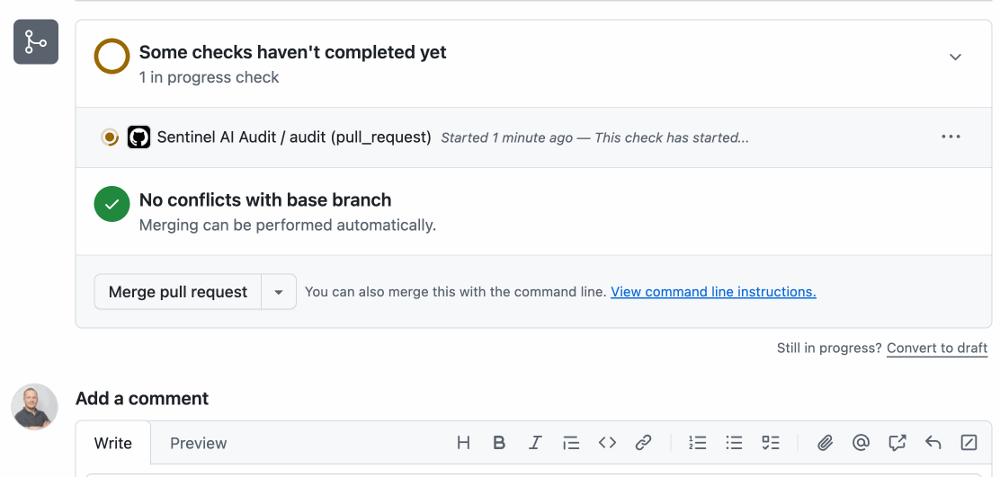
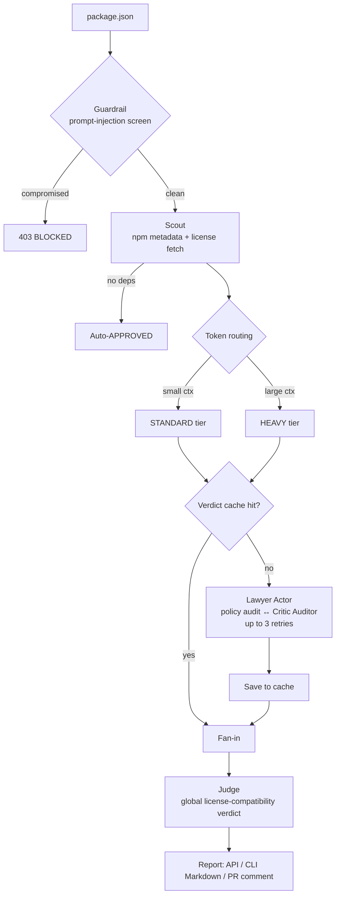

# 🛡️ Sentinel AI — Intelligent Dependency Auditor



Sentinel AI is a dependency security and license-compliance gatekeeper. It ingests a `package.json`, audits every package with a LangGraph Actor–Critic loop (Lawyer ↔ Critic), and returns a global compliance verdict — as a REST API, a CLI, or a GitHub Action comment on pull requests.

Runs fully local with **Ollama** (no cloud keys) or against **Groq** for CI, with **Qdrant** backing policy RAG and a verdict cache.

> **Supported manifests:** `package.json` (npm) only. Other ecosystems (`pyproject.toml`, `go.mod`, `pom.xml`, …) are not supported yet.

## ✨ Features

* **Prompt-injection guardrail** — an Llama Guard classifier screens the manifest first; malicious payloads are rejected with `403`.
* **Actor–Critic loop** — the *Lawyer* issues a license verdict via RAG over corporate policy; the *Critic* applies zero-trust review with up to 3 corrections per package.
* **Parallel + token-aware routing** — one audit branch per dependency (LangGraph `Send`), routed to a heavier or lighter model tier by context size.
* **UNKNOWN-license resolution** — pulls LICENSE text from GitHub and classifies it by embedding similarity; confident matches are audited, uncertain ones escalate to human review with the score attached.
* **Verdict caching** — repeat audits short-circuit the LLM via a Qdrant cache, keyed by a policy fingerprint so edits invalidate stale results.
* **Configurable policy** — allowed/forbidden/review lists, UNKNOWN-license thresholds, and the Judge rulebook all live in `.sentinel.yml`.
* **CI-native** — GitHub Action runs on PRs, posts a Markdown report, fails on forbidden licenses, and skips when no watched files change.

## 🚀 Quick Start (Local, Ollama)

**Requirements:** Docker Desktop (for Qdrant), Ollama at `http://localhost:11434`, Python 3.11+.

```bash
python -m venv venv && source venv/bin/activate
pip install -r requirements.txt
cp .env.example .env                 # optional — LangSmith tracing / Groq
# set provider: ollama in sentinel.models.yml for a fully-local run
venv/bin/python run_stack.py
```

`run_stack.py` bootstraps everything: verifies Docker, starts/creates the `qdrant` container (ports 6333/6334), seeds `corporate_policies` if empty, pulls any missing Ollama models, and launches FastAPI on `http://0.0.0.0:8000`. With `provider: groq` + a valid `GROQ_API_KEY`, it skips the Ollama checks and audits in the cloud.

## 🔌 API

```bash
curl -X POST "http://127.0.0.1:8000/api/v1/audit" \
     -H "Content-Type: application/json" \
     -d @fixtures/package.json
```

```json
{
  "status": "success",
  "thread_id": "…",
  "global_verdict": "APPROVED",
  "global_summary": "…",
  "results": [
    { "package_name": "lodash", "version": "4.17.21", "license": "MIT", "verdict": "SAFE", "reasoning": "…" }
  ]
}
```

A manifest with prompt-injection text (try `fixtures/malicious_package.json`) returns `403`. Pass `X-Thread-Id: <id>` to pin the run to a resumable checkpoint thread, then read every step back from `GET /api/v1/audit/<thread_id>/history`. Interactive docs: `http://localhost:8000/docs`.

## 💻 CLI

```bash
python -m app.cli --package-json fixtures/package.json
```

* Prints a GitHub-flavored Markdown report; `--output report.md` also saves it locally.
* Exit code `1` when the guardrail blocks the manifest or any package is `FORBIDDEN` / the global verdict is `REJECTED_WITH_CONFLICTS` — otherwise `0`.
* In GitHub Actions it auto-writes the step summary and posts a PR comment.

## 🛠️ How It Works



1. **Guardrail** — screens the raw manifest; instruction-override attempts terminate with `403`.
2. **Scout** — merges `dependencies` + `devDependencies`, resolves versions/licenses from npm, fetches GitHub LICENSE text for UNKNOWN packages, short-circuits empty trees to `APPROVED`.
3. **Fan-out** — one branch per package, routed STANDARD/HEAVY by token count.
4. **Lawyer ↔ Critic** — Actor emits `SAFE` / `FORBIDDEN` / `REVIEW_REQUIRED` grounded in policy (with similarity classification for UNKNOWN); Auditor rejects weak reasoning, up to 3 retries.
5. **Verdict cache** — keyed by package + license + policy fingerprint; hits bypass the LLM.
6. **Judge** — merges all branches (`operator.add`) and emits `APPROVED` or `REJECTED_WITH_CONFLICTS`.

## 📚 Documentation

* **[Configuration](docs/configuration.md)** — env vars, `.sentinel.yml` license policy, UNKNOWN-license handling, provider/model selection in `sentinel.models.yml`.
* **[CI integration](docs/ci-integration.md)** — GitHub Action and path-based change gating.

## 🧪 Testing

```bash
python scripts/run_evals.py
```

Runs the built-in eval dataset end-to-end against a running stack: malicious-manifest block, permissive trees, empty tree, and UNKNOWN-license cases, asserting global and per-package verdicts. Edit `fixtures/package.json` to try other trees.

## 🏗️ Project Structure

```text
sentinel-ai/
├── run_stack.py              # Bootstrap: Docker/Qdrant, policy seed, models, FastAPI
├── sentinel.models.yml       # Provider + per-role model selection
├── .sentinel.yml.example     # License policy template (copy to .sentinel.yml)
├── langgraph.json            # LangGraph dev/API graph definition
├── docs/                     # configuration.md, ci-integration.md, assets/
├── fixtures/                 # sample + malicious package.json
├── scripts/                  # seed_policy.py, run_evals.py
├── app/
│   ├── main.py               # FastAPI entrypoint
│   ├── cli.py                # CLI + GitHub Actions report publisher
│   ├── core/                 # config, model registry, logging, terminal
│   ├── agents/               # graph, state, subgraph_builder, nodes/
│   ├── services/             # llm, qdrant, license classifier, github, osv, token
│   └── api/                  # audit.py, history.py
└── .github/workflows/sentinel-test.yml
```

> **Note:** `backend/` is a legacy duplicate of the root application. CI and local runs use the top-level `app/` package only; treat `backend/` as pending removal.

## 📝 Developer Notes

* **Qdrant persistence**: without a Docker volume, policy vectors are lost on restart; `run_stack.py` re-seeds when `corporate_policies` is empty. `verdict_cache` is recreated on demand.
* **Checkpointer state**: local runs persist to `data/sentinel_state.db` (git-ignored). Delete it to reset audit history.
* **LangGraph Studio**: `langgraph.json` exposes the `audit_workflow` graph for `langgraph dev`.
* **GitHub API rate limits**: license evidence lookups hit the unauthenticated API (60 req/h). Set `GITHUB_TOKEN` for large scans.

## 📄 License

[Apache-2.0](LICENSE)
